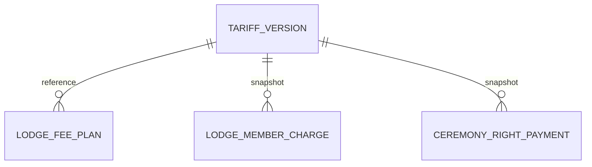

# PMGM-DB-007 — Tarifario por decreto y geografía desde Ficha

Issue #190, PR #318. Fuente normativa: INSTRUCCIONES PARA CHATGPT v2 del 04-10 y Decreto 1.759. Base dev `c81f68dabf52f03875f947a23964c91d30994d56`. Sustituye tarifas monetarias codificadas y clasificación independiente de Tesorería. No cambia reglas de Hospitalaria ni convierte monedas.

## Antes y después

Antes: importe oficial resuelto desde constantes y TreasuryTerritory editable en Tesorería; sin catálogo versionado. Después: catálogo persistido, selección por fecha y zona obtenida de City/Country en Ficha. Las versiones son registros nuevos, sin PUT/PATCH/DELETE; borrador no aplica. Una publicación sólo comienza desde el primer día de un mes futuro. La versión publicada con mayor vigencia y luego versión gobierna; una celda ausente o versión expirada bloquea el cálculo, nunca recupera tarifas de otro decreto.

## Diccionario físico

Esquema `core`, migración `20261004205000_AddGrandTreasuryTariffVersions`.

| Tabla/campo | Tipo | Nulo | Restricción / relación |
|---|---|---|---|
| grand_treasury_tariff_versions.Id | uuid | No | PK |
| Version | integer | No | índice único, control ExpectedVersion y transacción serializable |
| Number | varchar(80) | No | número decretado |
| DecreeDate, EffectiveFrom | date | No | decreto y comienzo |
| EffectiveUntil | date | Sí | término inclusivo |
| SourceReference | varchar(1200) | No | PDF o referencia de respaldo |
| Status | varchar(20) | No | draft / published |
| Payload | jsonb | No | Rates, CeremonyRights, Unemployment, contrato tipado |
| RecordedAtUtc | timestamptz | No | registro UTC; auditoría separada con sujeto y acción |
| organizations.OrienteCode | varchar(40) | Sí | santiago / other_chile / peru; derivado y validado con City/Country |
| lodge_fee_plans.TariffVersionId | uuid | Sí | FK al decreto, restrict; índice |
| lodge_member_charges.TariffVersionId | uuid | Sí | FK al decreto, restrict; índice |
| ceremony_right_payments.TariffVersionId | uuid | Sí | FK al decreto, restrict; índice |
| ceremony_right_payments.RightAmount | numeric(18,2) | Sí | importe total del derecho congelado al registrar pago |

Índice adicional del catálogo: EffectiveFrom/Version. Payload ordinario: zona×categoría, Amount decimal y Currency CLP/USD. CeremonyRights: zona×ceremonia, Amount/Currency propios. Unemployment: zona×trimestre, DiscountPercent = rebaja, Amount resultante, Currency. CLP entero, USD dos decimales, importes no negativos. Categorías: normal, spouse, senior, student, past_active; Past Activo debe ser cero y permanece excluido de cargos ordinarios.

Datos institucionales financieros, no catálogo público ni datos personales en payload. Lectura/escritura de versiones: atribución institucional de Gran Tesorería. Consulta oficial local limitada a su Taller y permiso dinámico view. Auditoría `treasury.tariff.version_registered` incluye identificación del decreto y vigencia. Sólo registro de versión nueva; sin sustitución ni borrado de histórico.

## Migración y fidelidad

Seed persistido del Decreto 1.759: fecha 15-12-2025, vigencia 01-01-2026. Chile Santiago/Regiones y ordinaria Perú 6 USD. Perú cónyuge/estudiante/tercera edad y cesantía no definidos: no se inventan. Derechos iniciales de cinco ceremonias iguales en las tres zonas, todos CLP. Cesantía Chile: rebaja 100/75/50/25 %, no porcentaje a pagar.

Geografía: se usa ciudad/país existente; clasificación legacy sólo completa país ausente y ciudad Santiago cuando esa clasificación lo permite. No se inventan ciudades regionales/peruanas. Una Ficha incompleta queda pendiente y bloquea nuevos cálculos. TreasuryTerritory queda caché derivado compatible, no fuente ni edición separada. Consulta antigua de actualización devuelve 409 indicando Ficha.

Los registros financieros existentes no se actualizan: importe, período, moneda, recibos y cierres intactos. Nuevos cargos guardan decreto e importe oficial + sobrepago local original del plan. Los Cuadros usan snapshots de cargos existentes; para nuevas líneas sin cargo consultan decreto de fecha de corte. Primer pago nuevo de un derecho congela total/moneda/decreto, incluso si después cambia Ficha. Pagos legacy sin estos campos resuelven decreto por primera fecha registrada y geografía actual, sin inventar fuente histórica ausente; valores existentes permanecen intactos.

Down retira estructura añadida pero no restaura la normalización de geografía. Restauración íntegra requiere respaldo previo; no ejecutar downgrade en producción para revertir ubicación. Instalar sólo tras proceso QA autorizado; este PR no instala ni ejecuta UAT.

## Contrato y pruebas

GET/POST `/api/tesoreria/tarifarios/decretos`; POST exige ExpectedVersion, header y tablas completas del snapshot. 201 registro, 409 versión obsoleta/concurrente, 400 validación, 403 permisos. GET `/api/tesoreria/tarifario-cuotas?asOf=...&organizationId=...` devuelve decreto aplicable y tablas limitadas a zona local. Sin actualización de versión, y las modificaciones requieren repetir íntegro el snapshot en otro registro. Consulta de Orientes de solo lectura.

Pruebas: vigencia futura, borradores, expiración sin fallback, omisiones Perú, cesantía, exención, zona desde Ficha, precisión, duplicados, registro/auditoría/ExpectedVersion PostgreSQL y paridad exacta del seed backend/demo. Resultados finales en handoff y recibos del PR.

## Relaciones del incremento

Cada entidad financiera tiene cero o una versión vinculada: nulo preserva antecedentes legacy sin atribuirles un decreto no demostrado. Una versión admite múltiples planes/cargos/pagos y no puede borrarse con referencias. Los FK corresponden a Id UUID y TariffVersionId UUID nullable, con índices convencionales EF.
