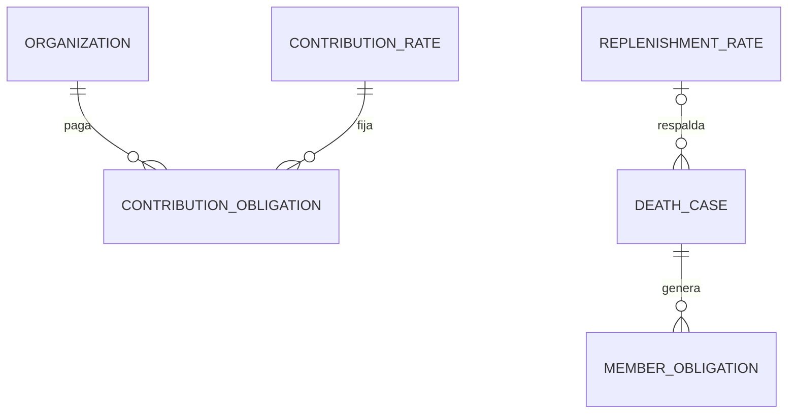

# Datos — Mi ficha y Hospitalaria v2 — #354 / #355

Fuente PO: instrucciones Drive v2 1nQ9GAePY0GLTpfMb62OqGqE9FYdKyFea98nPcQp8e3w. Base dev c2617b427e78af4cb70160848953cbf9f56f8dd4. Rama feature/member-hospitalaria-v2-20261007-gpt. Estado en rama, CI/publicación pendientes. Schema instalado no comprobado; srv01/UAT pausados. Registro anterior Hospitalaria: Entities/DeathReplenishment.cs y migración 20260923000000; accesos de Orden #348 y Tesorería #350 preservados.

## Diccionario actualizado del cambio

| Tabla core / contrato | Campos | Tipo SQL/JSON y tamaño | Nulabilidad/default y validación | Clasificación/acceso |
|---|---|---|---|---|
| hospitalaria_replenishment_rates | DecreeNumber; DecreeDate | varchar80; date | nullable en legado; obligatorios al registrar decreto; fecha <= vigencia; referencia <=500; monto CLP positivo entero | metadatos normativos; Gran Hospitalaria create/view |
| hospitalaria_death_replenishment_cases | RateId | uuid FK | nullable legado; nuevas obligaciones copian tarifa vigente a DeathDate | pertenencia sensible; Hospitalaria autorizada/consulta propia minimizada |
| hospitalaria_contribution_rates | Id; Amount; EffectiveFrom; EffectiveUntil; CreatedBySubject; CreatedAtUtc | uuid PK; numeric18,2; date; date?; varchar320; timestamptz | Amount6000 inicial; positivo entero; vigencia inicial al instalar en Chile; cambios hoy/futuro; actor obligatorio; timestamp UTC | dato financiero institucional; Gran Hospitalaria create/view |
| hospitalaria_contribution_obligations | Id; OrganizationId; RateId; PeriodYear; PeriodMonth; AmountDue | uuid PK/FK/FK; int; int; numeric18,2 | todos obligatorios; año1..9999 mes1..12; snapshot inmutable monto positivo entero; único Taller/año/mes | obligación del Taller, sin MemberId; Hospitalaria Taller/Gran |
| hospitalaria_contribution_obligations | Status; PaymentDate; PaymentReference; RecordedBySubject; ReviewedBySubject; ReviewedAtUtc; ReviewNotes; CreatedAtUtc | varchar30; date?; varchar500?; varchar320?; varchar320?; timestamptz?; varchar2000?; timestamptz | pending → submitted → reconciled/observed; observed puede reenviar; pago completo con respaldo; revisión auditada; actor de sesión | financiero institucional y comprobante restringido; no consulta propia del hermano |
| GET /api/membership/me/cargos | id,cargo,periodo,tallerId,taller,desde,hasta | UUID/string/string/UUID/string/date?/date? | proyección OfficeAssignments existente, exclusivamente MemberId resuelto desde identidad; sin EvidenceReference | historial sensible propio, no-store |
| GET /api/membership/me/asistencias | id,fecha,tipo,tema,tallerId,taller,estado | UUID/date/enum/string?/UUID/string/enum | fuentes LodgeAttendanceRecords y LodgeInstructionAttendanceRecords; latest RecordedAtUtc por actividad; held/closed; ceremonia si CeremonyType; presente/justificado/ausente; rango inclusivo, default12meses Chile; resumen derivado total/conteos | actividad sensible propia; sin excuses, instructor ni otros asistentes |
| GET /api/membership/me/hospitalaria | id,caseId,tallerId,taller,fecha,hermanoFallecido,moneda,monto,pagado,saldo,estado,fechaPago,comprobantes,decreto | UUIDs/strings/date/CLP/decimal18,2/date?/array/object? | propias obligaciones existentes; pagado sum pagos; saldo monto-pagado; fechaPago sólo si paid; decreto por RateId, null explícito legado | financiero sensible propio; sólo nombre del fallecido necesario al concepto, sin RUT/contactos |
| Rendiciones Hospitalaria (GET) | monthlyContributions | array DTO | aporte mensual separado en respuesta adicional; sin mezclar con ReplenishmentDueAmount ni alterar caja histórica | Taller autorizado/Gran Hospitalaria view |

## Relaciones e integridad

| Tabla | PK y FK | Cardinalidad/índices | Borrado |
|---|---|---|---|
| replenishment_rates → death_cases | rates.Id → cases.RateId | 1:N opcional legado; índice RateId; DeathStatusEventId único existente con FK status_events | restrict |
| contribution_rates → contribution_obligations | rates.Id → obligations.RateId | 1:N; vigencia rates.EffectiveFrom única; índice RateId | restrict |
| organizations → contribution_obligations | organizations.Id → obligations.OrganizationId | 1:N; único OrganizationId/PeriodYear/PeriodMonth | restrict |

## Antes/después y migración

Antes: sincronización manual, decreto texto libre, sin aporte por Taller ni endpoints propios. Después: POST /api/hospitalaria/talleres/{id}/defunciones registra evento y genera caso/obligaciones/auditoría en una transacción; lock PostgreSQL3541500 serializa sincronización/registro/decreto; fallecimiento repetido409; respaldo sigue disponible. Activos a fecha de fallecimiento, excluye fallecido/Past Activo. No se concede cargo/autoridad nueva. Registro falta decreto vigente devuelve409 sin registrar defunción; las tarifas nuevas no pueden ser retroactivas.

Migración 20261007120000 añade columnas nullable y tablas nuevas. Sin backfill de decreto/RateId: no se inventa normativa histórica ni se recalculan montos. Aporte6000 se inicializa al instalar, desde fecha Chile; no se crea deuda por meses anteriores a esa instalación. Generador mensual (worker/reintento cada minuto y consulta autorizada) usa lock3546000 y unique Taller/período; captura versión vigente, no cambia obligaciones existentes aunque cambie monto. No usa cantidad de hermanos. Talleres nuevos se incluyen desde su creación. Pago y revisión serializados y auditados; rendiciones devuelven aportes por separado. No hay nueva conversión CLP/USD, nueva regla de ceremonias ni cambio de retención.

Down elimina tablas/columnas nuevas y perdería evidencia nueva; no ejecutar rollback destructivo sobre datos reales, restaurar respaldo siguiendo runbook vigente. No se instaló.

Clientes getOwnOffices/getOwnAttendance/getOwnHospitalaria y ejemplos sintéticos compatibles; UI/App/CSS siguen reservados por Claude #353. Contratos y demo frontend de Hospitalaria pendientes de conectar por Claude. Las respuestas privadas usan no-store y nunca toman memberId del cliente.

## Evidencia

Gates locales migraciones/privacidad/clasificación PASS; frontend build/lint y dos contratos nuevos PASS. Pruebas HTTP PostgreSQL agregadas para generación/duplicados, propio versus ajeno, filtros/resumen, desvinculación, aporte único por Taller y conciliación separada. CI backend exact-head pendiente; no afirmar validación sólo por compilar o por tests que no se ejecuten sin PostgreSQL. SHA final/Actions/Pages/paquete: completar en recibo PR/Issue y Drive.

Selector de fallecimiento: GET /api/hospitalaria/talleres/{organizationId}/defunciones/candidatos sólo id/nombre de membresías activas locales sin defunción previa; requiere permisos institucionales y dinámicos create de Hospitalaria. No expone RUT/contacto/cargos. No modifica schema ni retención. Contratos conectados a las vistas sobre dev@50ac801; estados previos pendientes de conexión quedan supersedidos.
